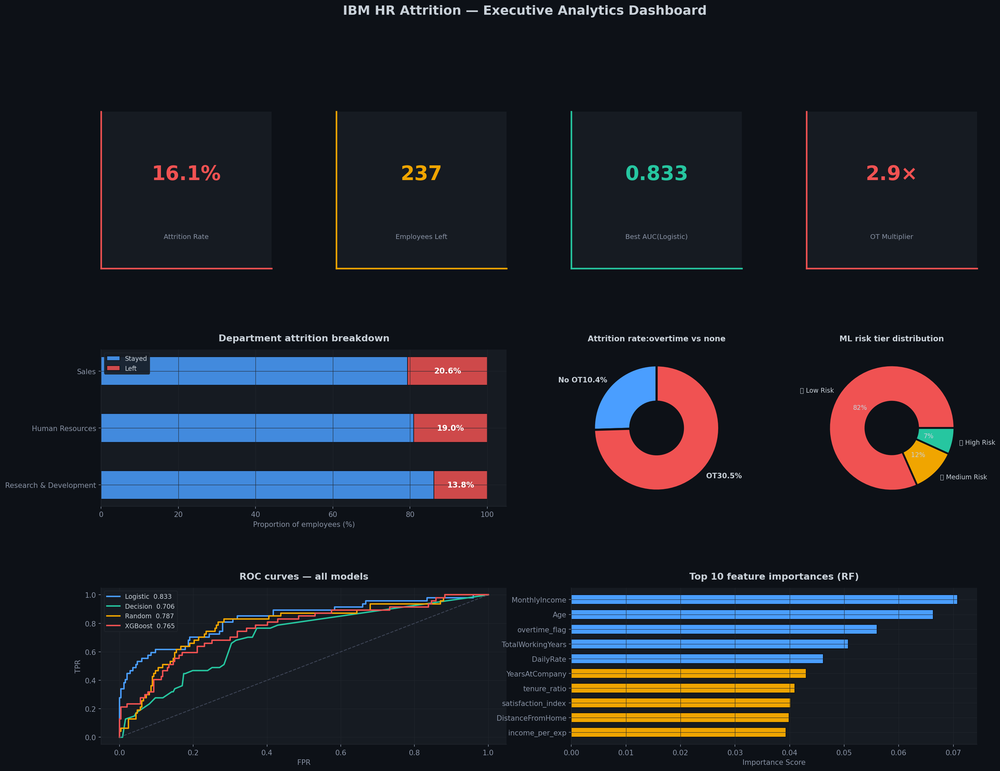

<div align="center">

# 🏢 IBM HR Employee Attrition Analysis

### End-to-End People Analytics · Predictive Modeling · SHAP Explainability

[](https://python.org)
[](https://jupyter.org)
[](https://scikit-learn.org)
[](https://xgboost.readthedocs.io)
[](https://shap.readthedocs.io)
[](https://kaggle.com/zohairbaloch)

**By Zohair Baloch** ·  Data Analyst 

[LinkedIn](https://linkedin.com/in/zohair-baloch-data-analyst) · [Kaggle](https://kaggle.com/zohairbaloch) · [GitHub](https://github.com/zohairbaloch-64)

</div>

---

## 📌 Project Overview

Employee attrition is one of the most expensive HR challenges an organization faces. Replacing a single employee can cost **50–200% of their annual salary** — accounting for recruitment, onboarding, lost productivity, and team disruption.

This project delivers a **full-stack people analytics solution** using the IBM HR Employee Attrition dataset. It answers two core questions:

> **"What drives employees to leave — and which employees are most likely to leave next?"**

The notebook is structured around the **PACE framework** (Plan · Analyze · Construct · Execute) and produces both a **predictive ML model** and **actionable business recommendations** that HR leadership can implement immediately.

---

## 📊 Dataset

| Attribute | Value |
|-----------|-------|
| **Source** | [IBM HR Analytics — Kaggle](https://www.kaggle.com/datasets/rishikeshkonapure/hr-analytics-prediction) |
| **Records** | 1,470 employees |
| **Features** | 35 columns |
| **Target** | `Attrition` (Yes / No) |
| **Attrition Rate** | 16.1% (237 employees left) |
| **Missing Values** | Zero |
| **Duplicates** | Zero |

### Key Features

| Feature | Type | Description |
|---------|------|-------------|
| `Attrition` | Target | Whether the employee left — Yes / No |
| `Age` | Numeric | Employee age |
| `MonthlyIncome` | Numeric | Monthly salary in USD |
| `OverTime` | Categorical | Works overtime — Yes / No |
| `JobSatisfaction` | Ordinal | Job satisfaction score \[1–4\] |
| `EnvironmentSatisfaction` | Ordinal | Workplace environment score \[1–4\] |
| `WorkLifeBalance` | Ordinal | Work-life balance score \[1–4\] |
| `YearsAtCompany` | Numeric | Company tenure |
| `StockOptionLevel` | Ordinal | Equity level \[0–3\] |
| `YearsSinceLastPromotion` | Numeric | Time since last promotion |
| `BusinessTravel` | Categorical | Travel frequency |
| `MaritalStatus` | Categorical | Single / Married / Divorced |
| `Department` | Categorical | HR / R&D / Sales |
| `JobRole` | Categorical | 9 distinct roles |
| *+ 21 more* | — | Demographics, financials, satisfaction |

---

## 🔑 Key Findings

| # | Finding | Attrition Impact |
|---|---------|-----------------|
| 1 | **Overtime employees** leave at 30.5% vs 10.4% for non-OT | **2.9× multiplier** |
| 2 | **Leavers earn 38% less** — median $3,202 vs $5,204 for stayers | Income is a primary driver |
| 3 | **Sales Representatives** have 39.8% attrition — highest of any role | Nearly 1 in 2 leaves |
| 4 | **Entry-level (Job Level 1)** employees leave at 26.3% | Career growth is lacking |
| 5 | **Zero stock options** → 24.4% attrition vs 9.4% with Level 1 equity | **2.6× multiplier** |
| 6 | **Single employees** leave at 25.5% vs 12.5% married | Life-stage mobility |
| 7 | **Frequent travelers** leave at 24.9% vs 8.0% non-travelers | Travel fatigue is real |
| 8 | **Year 0–1** has 34–36% attrition — the critical onboarding window | First year is make-or-break |
| 9 | **Low job satisfaction (score 1)** → 22.8% vs 11.3% at score 4 | Satisfaction is protective |
| 10 | **Poor work-life balance (score 1)** → 31.3% attrition | Compounding burnout risk |

---

## 🔧 Feature Engineering

Seven domain-informed features were created before modeling:

| Feature | Description |
|---------|-------------|
| `overtime_flag` | Binary indicator — employee works overtime |
| `satisfaction_index` | Average of job, environment & relationship satisfaction scores |
| `income_per_exp` | Monthly income ÷ (total working years + 1) — compensation efficiency |
| `tenure_ratio` | Years at company ÷ (total working years + 1) — company loyalty fraction |
| `long_commute` | Binary flag — commute distance > 15 km |
| `no_stock_equity` | Binary flag — employee has zero stock option compensation |
| `career_stagnation` | No promotion in ≥3 years AND tenure ≥3 years — stagnation signal |

---

## 🤖 Models

Four classifiers were trained and evaluated with **5-fold stratified cross-validation**:

| Model | Strategy |
|-------|----------|
| **Logistic Regression** | L2-regularized, class-weighted — interpretable baseline |
| **Decision Tree** | Depth-limited, class-weighted — transparent rule-based model |
| **Random Forest** | 300 trees, balanced classes — robust ensemble benchmark |
| **XGBoost** | 300 rounds, scale_pos_weight=5 — state-of-the-art gradient boosting |

### Evaluation Metrics

Models are evaluated on **AUC-ROC, F1-Score, and Recall** (not raw accuracy) because:
- A naïve "always predict Stayed" model achieves 83.9% accuracy but catches **zero** at-risk employees
- **Recall** on the minority class (employees who leave) is the metric that matters most for HR intervention
- **AUC-ROC** provides threshold-independent comparison across models

---

## 🔬 SHAP Explainability

SHAP (SHapley Additive exPlanations) is applied to the XGBoost model to provide:

- **Bar summary** — global feature importance ranked by mean |SHAP value|
- **Beeswarm plot** — direction and magnitude of each feature's effect per employee
- Instance-level explanations: HR can understand *exactly why* any individual employee is flagged as high-risk

---

## 📈 Executive Dashboard

A single-page dashboard consolidates:
- 4 KPI cards (Attrition Rate, Headcount Left, Best AUC, OT Multiplier)
- Department attrition stacked bar
- Overtime donut chart
- ML risk tier distribution
- ROC curves for all four models
- Top 10 feature importances




---

## 💡 Business Recommendations

| Priority | Intervention | Evidence |
|----------|-------------|---------|
| 🔴 **1** | Enforce monthly overtime caps + OT compensation | 2.9× attrition multiplier |
| 🔴 **2** | Market salary benchmarking — especially Job Level 1 | 38% income gap |
| 🟡 **3** | Redesign Sales Representative career ladder | 39.8% role attrition |
| 🟡 **4** | Structured onboarding programme — 30/60/90 day milestones | 34–36% Year 0–1 attrition |
| 🟡 **5** | Expand stock option eligibility to all Level 1–2 employees | 2.6× equity multiplier |
| 🟢 **6** | Video-first travel policy — reduce frequent business travel | 24.9% vs 8.0% |

---

## 📁 Project Structure

```
IBM-HR-Attrition-Analysis/
│
├── IBM_HR_Attrition_Final.ipynb   # Main notebook — full PACE pipeline
├── HR-Employee-Attrition.csv      # Dataset
├── README.md                      # This file
│
└── outputs/                       # Saved figures
    ├── 01_target.png
    ├── 02_age_income.png
    ├── 03_ot_sat_wlb.png
    ├── 04_dept_role.png
    ├── 05_tenure_stock.png
    ├── 06_travel_marital_level.png
    ├── 07_education_envsat.png
    ├── 08_heatmap.png
    ├── 09_model_comparison.png
    ├── 10_roc_cm.png
    ├── 11_feature_importance.png
    ├── 12_shap_bar.png
    ├── 13_shap_beeswarm.png
    └── 14_executive_dashboard.png
```

---

## 🛠️ Tech Stack

| Library | Version | Purpose |
|---------|---------|---------|
| `pandas` | ≥ 2.0 | Data manipulation & EDA |
| `numpy` | ≥ 1.24 | Numerical operations |
| `matplotlib` | ≥ 3.7 | Custom visualizations |
| `seaborn` | ≥ 0.12 | Statistical plots & heatmap |
| `scikit-learn` | ≥ 1.3 | Preprocessing, models, metrics |
| `xgboost` | ≥ 1.7 | Gradient boosting classifier |
| `shap` | ≥ 0.42 | Model explainability |

---

## 🚀 How to Run

### Option 1 — Kaggle (Recommended)

1. Open the notebook on [Kaggle]([https://www.kaggle.com/code/zohairbaloch/hr-analytics-employee-attrition-prediction])
2. Add the dataset: `HR-Employee-Attrition.csv`
3. Click **Run All** — no setup required

### Option 2 — Local

```bash
# 1. Clone the repository
git clone https://github.com/zohairbaloch-64/ibm-hr-attrition-analysis.git
cd ibm-hr-attrition-analysis

# 2. Install dependencies
pip install pandas numpy matplotlib seaborn scikit-learn xgboost shap jupyter

# 3. Launch the notebook
jupyter notebook IBM_HR_Attrition_Final.ipynb
```

> **Note:** Update the dataset path in cell 2 from `/kaggle/input/...` to your local path.

---

## 📐 PACE Framework

This project follows the **PACE** structured analytics framework:

| Stage | Focus | Deliverable |
|-------|-------|-------------|
| 📌 **Plan** | Define business problem · Understand dataset schema | Problem statement + success metrics |
| 🔍 **Analyze** | EDA · Data cleaning · 8 visualization sections | Key insights & patterns |
| 🔧 **Construct** | Feature engineering · 4 ML models · Cross-validation | Trained classifiers |
| ✅ **Execute** | Evaluate models · SHAP · Dashboard · Recommend | Business impact + action plan |

---

## 📬 Connect

<div align="center">

| Platform | Link |
|----------|------|
| 💼 LinkedIn | [linkedin.com/in/zohair-baloch-data-analyst](https://linkedin.com/in/zohair-baloch-data-analyst) |
| 📊 Kaggle | [kaggle.com/zohairbaloch](https://kaggle.com/zohairbaloch) |
| 🐙 GitHub | [github.com/zohairbaloch-64](https://github.com/zohairbaloch-64) |
| 📧 Email | zohairbaloch.7164@gmail.com |

</div>

---

<div align="center">

**⭐ If this project helped you, please give it a star on GitHub or an upvote on Kaggle — it motivates more quality public work!**

*Made with 🔵 Python · ❤️ Data Science · 🎯 Business Impact*

</div>
